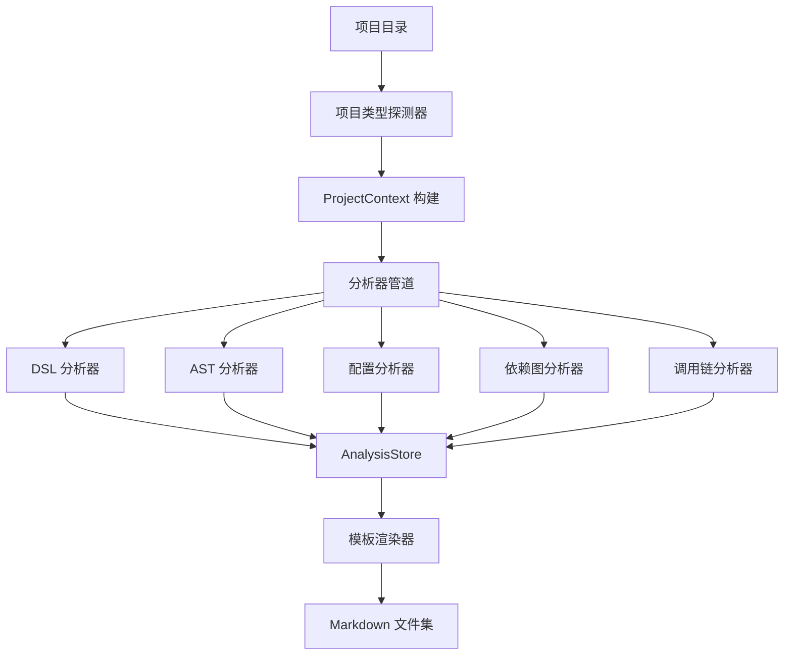

# go-spector：go-zero 项目代码文档生成器

## 一、项目目标

### 1.1 定位

go-spector 是 cztctl 的子命令，对标 Java 生态的 ai-spector 工具，目标是：

- **输入**：一个符合 go-zero 规范的微服务项目目录
- **输出**：一套结构化 Markdown 文档（27 个文件），描述项目全貌
- **核心价值**：让新成员快速理解项目、辅助 AI 代码生成、支撑架构审查

### 1.2 与 ai-spector 的关系

| 维度 | ai-spector (Java) | go-spector (Go) |
|------|-------------------|-----------------|
| 目标语言 | Java (Spring Boot) | Go (go-zero) |
| DSL 驱动 | 无（靠注解） | .api / .proto / .cron / .rabbitmq |
| 项目结构 | 约定式 | 强制规范（goctl 生成） |
| 分析手段 | 反射 + 字节码 | go/ast + DSL 解析 |

### 1.3 设计原则

1. **DSL 优先**：DSL 是 source of truth，AST 分析作为补充
2. **复用现有基础设施**：复用 cztctl 已有的 ANTLR4 解析器和 spec 中间表示
3. **管道化架构**：分析器独立、可组合、可增量扩展
4. **最小外部依赖**：核心使用 Go 标准库 `go/ast` + `go/parser` + `go/token`；MVP 阶段引入 `golang.org/x/tools/go/packages` 补充类型推导

---

## 二、命令接口设计

### 2.1 命令名称与层级

```
cztctl spector [flags]
```

融入现有命令树：
```
cztctl
├── api
│   ├── swagger
│   ├── cron
│   └── rabbitmq
├── rpc
│   └── sdk
├── env
└── spector          ← 新增
```

### 2.2 参数设计

| 参数 | 短名 | 必填 | 默认值 | 说明 |
|------|------|------|--------|------|
| `--dir` | `-d` | 是 | `.` | 待扫描项目根目录 |
| `--output` | `-o` | 否 | `./.spector` | 输出文档目录 |
| `--type` | `-t` | 否 | `auto` | 项目类型：`api`/`rpc`/`cron`/`rabbitmq`/`auto` |
| `--analyzers` | `-a` | 否 | `all` | 指定运行的分析器（逗号分隔） |
| `--verbose` | `-v` | 否 | `false` | 输出详细分析日志 |

### 2.3 使用示例

```bash
# 自动探测项目类型，全量生成
cztctl spector --dir /path/to/project --output ./docs/spector

# 仅生成概览和接口文档
cztctl spector -d . -a overview,api-rest,logic

# 指定 RPC 项目类型
cztctl spector -d ./rpc/order -t rpc
```

### 2.4 输出目录结构

```
.spector/
├── 00-index.md
├── 00-overview.md
├── 02-api-rest.md
├── 03-api-rpc.md
├── 03b-api-contract.md
├── 04-logic.md
├── 05-model.md
├── 06-data-model.md
├── 07-types.md
├── 08-enums.md
├── 09-svc-context.md
├── 10-infra.md
├── 11-mq.md
├── 12-cache.md
├── 13-config.md
├── 14-dependency.md
├── 15-middleware.md
├── 16-api-chain.md
├── 17-error-codes.md
├── 18-service-deps.md
├── 19-er-overview.md
├── 20-env-config.md
├── 21-business-flow.md
├── 22-impact-map.md
├── 23-state-machines.md
├── 24-business-rules.md
└── 25-common-deps.md
```

---

## 三、架构设计

### 3.1 整体架构图



### 3.2 核心抽象

```go
package spector

import (
    "context"
    "go/ast"
    "go/token"
)

// ProjectType 项目类型枚举
type ProjectType string

const (
    ProjectTypeAPI      ProjectType = "api"
    ProjectTypeRPC      ProjectType = "rpc"
    ProjectTypeCron     ProjectType = "cron"
    ProjectTypeRabbitMQ ProjectType = "rabbitmq"
)

// ProjectContext 项目上下文，所有分析器共享
type ProjectContext struct {
    RootDir     string
    ProjectType ProjectType
    ModulePath  string        // go.mod 中的 module 路径
    GoVersion   string        // go.mod 中的 go 版本
    ServiceName string        // 服务名称
    FileSet     *token.FileSet
    Packages    map[string]*ast.Package // 按相对路径索引
}

// AnalysisStore 分析结果存储，分析器写入、渲染器读取
type AnalysisStore struct {
    Overview      *OverviewData
    APIRoutes     []RouteInfo
    RPCMethods    []RPCMethodInfo
    Logics        []LogicInfo
    Models        []ModelInfo
    SvcContext    *SvcContextInfo
    Config        *ConfigInfo
    Dependencies  *DependencyInfo
    CallChains    []CallChain
    // ... 更多字段对应各分析器产物
}

// Analyzer 分析器接口
type Analyzer interface {
    // Name 分析器唯一名称
    Name() string
    // Analyze 执行分析，结果写入 store
    Analyze(ctx context.Context, pctx *ProjectContext, store *AnalysisStore) error
    // Dependencies 声明依赖的其他分析器（确保执行顺序）
    Dependencies() []string
}

// Renderer 渲染器接口
type Renderer interface {
    // Render 将分析结果渲染为 Markdown 文件
    Render(store *AnalysisStore, outputDir string) error
}

// FileRenderer 单文件渲染器（每个输出文件一个）
type FileRenderer struct {
    Filename string           // 输出文件名，如 "00-overview.md"
    Template string           // Go template 内容
    DataFunc func(*AnalysisStore) interface{} // 提取渲染数据
}
```

### 3.3 分析器清单

| 分析器名称 | 对应输出文件 | 主要数据来源 | 依赖分析器 |
|-----------|-------------|-------------|-----------|
| `overview` | 00-overview.md | go.mod + 目录结构 + config | - |
| `dsl-api` | 02-api-rest.md, 07-types.md | .api DSL 解析 | - |
| `dsl-proto` | 03-api-rpc.md, 03b-api-contract.md | .proto 解析 | - |
| `dsl-cron` | (嵌入 overview) | .cron DSL 解析 | - |
| `dsl-rabbitmq` | 11-mq.md (部分) | .rabbitmq DSL 解析 | - |
| `logic` | 04-logic.md | internal/logic/ AST | `dsl-api` 或 `dsl-proto` |
| `model` | 05-model.md, 06-data-model.md | sql/ 目录 AST | - |
| `svc-context` | 09-svc-context.md | svc/serviceContext.go AST | - |
| `config` | 13-config.md, 20-env-config.md | config/config.go AST + etc/*.yaml | - |
| `dependency` | 14-dependency.md | go.mod 解析 | - |
| `middleware` | 15-middleware.md | middleware/ + .api 声明 | `dsl-api` |
| `call-chain` | 16-api-chain.md, 21-business-flow.md | AST 调用图 | `logic`, `svc-context` |
| `enum` | 08-enums.md | 全项目常量扫描 | - |
| `error-code` | 17-error-codes.md | xerr 调用点 | - |
| `service-deps` | 18-service-deps.md | svc 中客户端分析 | `svc-context` |
| `cache` | 12-cache.md | sql/ + logic 缓存调用 | `model`, `logic` |
| `infra` | 10-infra.md | config + svc 初始化 | `config`, `svc-context` |
| `er` | 19-er-overview.md | sql/ 结构体关联推断 | `model` |
| `impact` | 22-impact-map.md | 反向调用图 | `call-chain` |
| `state-machine` | 23-state-machines.md | 枚举 + logic 状态变更 | `enum`, `logic` |
| `business-rules` | 24-business-rules.md | logic 条件分支 | `logic` |
| `common-deps` | 25-common-deps.md | utils/ + common/ | - |
| `index` | 00-index.md | 汇总所有分析器统计 | 所有分析器 |

### 3.4 类型推导策略（go/types 补充）

纯 `go/ast` 在以下场景准确率不足：
- import alias 导致类型名无法精确匹配（如 `rpc "xxx/client"`）
- 接口类型字段无法仅通过字符串判断其实际实现
- 跨包类型引用需要解析完整依赖图

**MVP 阶段决策**：对 ServiceContext 分析引入 `golang.org/x/tools/go/packages` 获取类型信息。

```go
import "golang.org/x/tools/go/packages"

// loadPackageTypes 加载包的类型信息，用于辅助 ServiceContext 字段分类
func loadPackageTypes(dir string) (*packages.Package, error) {
    cfg := &packages.Config{
        Mode: packages.NeedTypes | packages.NeedTypesInfo | packages.NeedSyntax,
        Dir:  dir,
    }
    pkgs, err := packages.Load(cfg, "./internal/svc")
    if err != nil {
        return nil, err
    }
    if len(pkgs) == 0 {
        return nil, fmt.Errorf("no packages found in %s/internal/svc", dir)
    }
    return pkgs[0], nil
}
```

**评估**：
- 工期影响：+2 工作日
- 收益：字段分类准确率从 ~65% 提升到 ~90%
- 降级策略：当 `go/packages` 加载失败时，回退到纯字段名后缀匹配

---

## 四、项目类型识别

### 4.1 探测策略

按优先级依次检测，同时覆盖 **DSL 源文件** 和 **已生成项目目录结构** 两种场景：

| 项目类型 | DSL 文件判定 | 已生成目录结构判定 |
|---------|-------------|------------------|
| API | `api/` 目录下存在 `.api` 文件 | `app/<service>/internal/handler/` 目录存在 |
| RPC | `proto/` 目录下存在 `.proto` 文件 | `rpc/<service>/internal/server/` 目录存在 |
| Cron | 项目根目录存在 `.cron` 文件 | `internal/handler/cron/` 子目录存在 |
| RabbitMQ | 项目根目录存在 `.rabbitmq` 文件 | 按消息类型分组的 handler 子目录存在（如 `internal/handler/order/`） |

```go
package spector

import (
    "os"
    "path/filepath"
    "strings"
)

// DetectProjectType 自动探测项目类型
// 策略：先检测 DSL 源文件（精确），再检测已生成目录结构（兼容无 DSL 场景）
func DetectProjectType(rootDir string) (ProjectType, error) {
    // === 阶段一：DSL 文件探测（精确判定）===

    // 1. 检查 .api 文件存在 → API 项目
    if hasFilesWithExt(rootDir, "api/", ".api") {
        return ProjectTypeAPI, nil
    }

    // 2. 检查 .proto 文件存在 → RPC 项目
    if hasFilesWithExt(rootDir, "proto/", ".proto") {
        return ProjectTypeRPC, nil
    }

    // 3. 检查 .cron 文件 → Cron 项目
    if hasFilesWithExt(rootDir, "", ".cron") {
        return ProjectTypeCron, nil
    }

    // 4. 检查 .rabbitmq 文件 → RabbitMQ 项目
    if hasFilesWithExt(rootDir, "", ".rabbitmq") {
        return ProjectTypeRabbitMQ, nil
    }

    // === 阶段二：已生成项目目录结构探测（兼容无 DSL 场景）===
    return detectByStructure(rootDir)
}

// detectByStructure 通过生成目录结构特征判定项目类型
func detectByStructure(rootDir string) (ProjectType, error) {
    // API：app/<service>/internal/handler/ 目录存在
    if matchesGlobPattern(rootDir, "app/*/internal/handler") {
        return ProjectTypeAPI, nil
    }

    // RPC：rpc/<service>/internal/server/ 目录存在
    if matchesGlobPattern(rootDir, "rpc/*/internal/server") {
        return ProjectTypeRPC, nil
    }

    // Cron：internal/handler/cron/ 子目录存在
    if dirExists(filepath.Join(rootDir, "internal/handler/cron")) {
        return ProjectTypeCron, nil
    }

    // RabbitMQ：按消息类型分组的 handler 子目录存在
    // 判定条件：internal/handler/ 下存在非 cron 的子目录，且子目录内有 listener 相关文件
    if hasMQHandlerSubdirs(rootDir) {
        return ProjectTypeRabbitMQ, nil
    }

    return "", fmt.Errorf("无法自动探测项目类型，请使用 --type 显式指定")
}

func hasFilesWithExt(root, subdir, ext string) bool {
    searchDir := filepath.Join(root, subdir)
    entries, err := os.ReadDir(searchDir)
    if err != nil {
        return false
    }
    for _, e := range entries {
        if filepath.Ext(e.Name()) == ext {
            return true
        }
    }
    return false
}

// matchesGlobPattern 检查是否存在匹配 glob 模式的目录
func matchesGlobPattern(root, pattern string) bool {
    matches, _ := filepath.Glob(filepath.Join(root, pattern))
    return len(matches) > 0
}

// dirExists 检查目录是否存在
func dirExists(path string) bool {
    info, err := os.Stat(path)
    return err == nil && info.IsDir()
}

// hasMQHandlerSubdirs 检查是否存在 MQ 消息分组的 handler 子目录
func hasMQHandlerSubdirs(rootDir string) bool {
    handlerDir := filepath.Join(rootDir, "internal/handler")
    entries, err := os.ReadDir(handlerDir)
    if err != nil {
        return false
    }
    for _, e := range entries {
        if e.IsDir() && e.Name() != "cron" {
            // 检查子目录内是否包含 listener 相关文件
            subEntries, _ := os.ReadDir(filepath.Join(handlerDir, e.Name()))
            for _, se := range subEntries {
                if strings.Contains(se.Name(), "listener") || strings.Contains(se.Name(), "consumer") {
                    return true
                }
            }
        }
    }
    return false
}
```

### 4.2 目录结构特征判定

| 特征 | 判定为 | 辅助特征 |
|------|--------|----------|
| 存在 `app/<name>/internal/handler/` | API 项目 | `internal/handler/routes.go` 存在 |
| 存在 `rpc/<name>/internal/server/` | RPC 项目 | `client/` 目录存在 |
| 存在 `internal/handler/cron/` | Cron 项目 | `workers.go` 文件存在 |
| 存在 `internal/handler/<msgtype>/` | RabbitMQ 项目 | `listeners.go` 文件存在 |

### 4.3 混合类型处理

go-zero 规范要求 api 和 rpc 物理分离，因此**不存在混合类型项目**。若 `--type=auto` 检测到多个特征，报错提示用户使用 `--type` 显式指定。

---

## 五、分析器详细设计

### 5.1 DSL 分析器（复用现有解析器）

#### 5.1.1 API DSL 分析器

**复用路径**：直接调用 goctl 的 `.api` 解析器（`github.com/zeromicro/go-zero/tools/goctl` 中的 parser）。

```go
package analyzer

import (
    "context"

    "github.com/zeromicro/go-zero/tools/goctl/api/parser"
    "github.com/lerity-yao/czt-contrib/cztctl/spector"
)

type DSLAPIAnalyzer struct{}

func (a *DSLAPIAnalyzer) Name() string { return "dsl-api" }

func (a *DSLAPIAnalyzer) Dependencies() []string { return nil }

func (a *DSLAPIAnalyzer) Analyze(ctx context.Context, pctx *spector.ProjectContext, store *spector.AnalysisStore) error {
    // 1. 在 api/ 目录下找到所有 .api 文件
    apiFiles := findFiles(pctx.RootDir, "api/", ".api")

    for _, f := range apiFiles {
        // 2. 调用 goctl 的 parser 解析 .api 文件
        spec, err := parser.Parse(f)
        if err != nil {
            return err
        }

        // 3. 提取路由信息写入 store
        for _, group := range spec.Service.Groups {
            for _, route := range group.Routes {
                store.APIRoutes = append(store.APIRoutes, spector.RouteInfo{
                    Method:       route.Method,
                    Path:         route.Path,
                    Handler:      route.Handler,
                    RequestType:  route.RequestTypeName(),
                    ResponseType: route.ResponseTypeName(),
                    Group:        group.GetAnnotation("group"),
                    Middleware:   group.GetAnnotation("middleware"),
                    Prefix:       group.GetAnnotation("prefix"),
                })
            }
        }

        // 4. 提取 Types 定义写入 store
        for _, t := range spec.Types {
            store.TypeDefs = append(store.TypeDefs, extractTypeDef(t))
        }
    }
    return nil
}
```

#### 5.1.2 Cron/RabbitMQ DSL 分析器

**复用路径**：直接调用 cztctl 现有的 `api/parser.Parse()`，它已支持 `.cron` 和 `.rabbitmq` 文件。

**Cron 分析字段定义**：

```go
// CronTaskInfo Cron 任务信息结构
type CronTaskInfo struct {
    TaskType   string // 任务类型（对应 DSL 中的 method）
    Handler    string // 处理器名称
    CronExpr   string // cron 表达式
    MaxRetry   int    // 最大重试次数
    ParamType  string // 参数类型名
    Group      string // 所属分组
}

// CronOverview Cron 服务概览统计
type CronOverview struct {
    TotalTasks   int            // 任务总数
    TasksByType  map[string]int // 按类型统计
    TasksByGroup map[string]int // 按分组统计
    HandlerDir   string         // 处理器目录（internal/handler/cron/）
    RegistryFile string         // 注册文件（workers.go）
}
```

**嵌入规则**：
- Cron 相关统计嵌入 `00-overview.md` 的服务概览部分
- 当 Cron 任务数 > 5 时，独立生成 `04b-cron.md`
- CronTaskInfo 的完整字段均需填充，确保统计完整

```go
package analyzer

import (
    "context"

    cztParser "github.com/lerity-yao/czt-contrib/cztctl/api/parser"
    "github.com/lerity-yao/czt-contrib/cztctl/spector"
)

type DSLCronAnalyzer struct{}

func (a *DSLCronAnalyzer) Name() string { return "dsl-cron" }

func (a *DSLCronAnalyzer) Dependencies() []string { return nil }

func (a *DSLCronAnalyzer) Analyze(ctx context.Context, pctx *spector.ProjectContext, store *spector.AnalysisStore) error {
    cronFiles := findFiles(pctx.RootDir, "", ".cron")
    for _, f := range cronFiles {
        spec, err := cztParser.Parse(f, nil)
        if err != nil {
            return err
        }
        for _, group := range spec.Service.Groups {
            for _, route := range group.Routes {
                store.CronTasks = append(store.CronTasks, spector.CronTaskInfo{
                    TaskType:   route.Method,
                    Handler:    route.Handler,
                    CronExpr:   route.Cron,
                    MaxRetry:   route.CronRetry,
                    ParamType:  route.RequestTypeName(),
                    Group:      group.GetAnnotation("group"),
                })
            }
        }
    }
    return nil
}
```

#### 5.1.3 Proto DSL 分析器

**策略**：使用 `google.golang.org/protobuf/compiler/protodesc` 或文本正则解析（go-zero 的 proto 结构简单固定）。

**约束检查**：proto 的 `package` 值必须等于 `option go_package` 的最后路径段。例如：
```proto
package order;
option go_package = "./order";  // ✅ 最后路径段 "order" == package "order"
```
若不一致，在输出文件中标注 "⚠️ Proto 命名规范：package 与 go_package 末段不一致"。

```go
package analyzer

import (
    "bufio"
    "context"
    "os"
    "regexp"
    "strings"

    "github.com/lerity-yao/czt-contrib/cztctl/spector"
)

var (
    serviceRe   = regexp.MustCompile(`^service\s+(\w+)\s*\{`)
    rpcRe       = regexp.MustCompile(`^\s*rpc\s+(\w+)\s*\((\w+)\)\s*returns\s*\((\w+)\)`)
    messageRe   = regexp.MustCompile(`^message\s+(\w+)\s*\{`)
    fieldRe     = regexp.MustCompile(`^\s*(\w+)\s+(\w+)\s*=\s*(\d+)`)
    packageRe   = regexp.MustCompile(`^package\s+(\w+)\s*;`)
    goPackageRe = regexp.MustCompile(`^option\s+go_package\s*=\s*"([^"]+)"\s*;`)
)

type DSLProtoAnalyzer struct{}

func (a *DSLProtoAnalyzer) Name() string { return "dsl-proto" }

func (a *DSLProtoAnalyzer) Dependencies() []string { return nil }

func (a *DSLProtoAnalyzer) Analyze(ctx context.Context, pctx *spector.ProjectContext, store *spector.AnalysisStore) error {
    protoFiles := findFiles(pctx.RootDir, "proto/", ".proto")
    for _, f := range protoFiles {
        file, err := os.Open(f)
        if err != nil {
            return err
        }

        scanner := bufio.NewScanner(file)
        var currentService string
        var pkgName, goPackage string
        for scanner.Scan() {
            line := strings.TrimSpace(scanner.Text())

            // 提取 package 和 go_package 用于约束检查
            if m := packageRe.FindStringSubmatch(line); m != nil {
                pkgName = m[1]
                continue
            }
            if m := goPackageRe.FindStringSubmatch(line); m != nil {
                goPackage = m[1]
                continue
            }

            if m := serviceRe.FindStringSubmatch(line); m != nil {
                currentService = m[1]
                continue
            }
            if m := rpcRe.FindStringSubmatch(line); m != nil && currentService != "" {
                store.RPCMethods = append(store.RPCMethods, spector.RPCMethodInfo{
                    Service:      currentService,
                    Method:       m[1],
                    RequestType:  m[2],
                    ResponseType: m[3],
                    ProtoFile:    f,
                })
            }
        }
        file.Close()

        // 约束检查：package == go_package 最后路径段
        if pkgName != "" && goPackage != "" {
            lastSeg := goPackage
            if idx := strings.LastIndex(goPackage, "/"); idx >= 0 {
                lastSeg = goPackage[idx+1:]
            }
            lastSeg = strings.TrimPrefix(lastSeg, ".")
            if lastSeg != pkgName {
                store.ProtoWarnings = append(store.ProtoWarnings, spector.ProtoWarning{
                    File:    f,
                    Message: "package 与 go_package 末段不一致",
                    Package: pkgName,
                    GoPackage: goPackage,
                })
            }
        }
    }
    return nil
}
```

### 5.2 Go AST 分析器

#### 5.2.1 核心工具函数

```go
package astutil

import (
    "go/ast"
    "go/parser"
    "go/token"
    "os"
    "path/filepath"
    "strings"
)

// ParseDir 解析目录下所有 Go 文件，返回 AST 包
func ParseDir(fset *token.FileSet, dir string) (map[string]*ast.Package, error) {
    return parser.ParseDir(fset, dir, func(fi os.FileInfo) bool {
        return !strings.HasSuffix(fi.Name(), "_test.go")
    }, parser.ParseComments)
}

// FindStructType 在文件中查找指定名称的结构体定义
func FindStructType(file *ast.File, name string) *ast.StructType {
    for _, decl := range file.Decls {
        genDecl, ok := decl.(*ast.GenDecl)
        if !ok || genDecl.Tok != token.TYPE {
            continue
        }
        for _, spec := range genDecl.Specs {
            typeSpec := spec.(*ast.TypeSpec)
            if typeSpec.Name.Name == name {
                if st, ok := typeSpec.Type.(*ast.StructType); ok {
                    return st
                }
            }
        }
    }
    return nil
}

// FindFuncDecls 查找文件中所有函数声明
func FindFuncDecls(file *ast.File) []*ast.FuncDecl {
    var funcs []*ast.FuncDecl
    for _, decl := range file.Decls {
        if fn, ok := decl.(*ast.FuncDecl); ok {
            funcs = append(funcs, fn)
        }
    }
    return funcs
}

// ExtractCallExprs 提取函数体中的所有调用表达式
func ExtractCallExprs(fn *ast.FuncDecl) []*ast.CallExpr {
    var calls []*ast.CallExpr
    ast.Inspect(fn.Body, func(n ast.Node) bool {
        if call, ok := n.(*ast.CallExpr); ok {
            calls = append(calls, call)
        }
        return true
    })
    return calls
}

// ExtractSelectorCalls 提取 receiver.Method() 形式的调用
func ExtractSelectorCalls(fn *ast.FuncDecl) []SelectorCall {
    var results []SelectorCall
    ast.Inspect(fn.Body, func(n ast.Node) bool {
        call, ok := n.(*ast.CallExpr)
        if !ok {
            return true
        }
        sel, ok := call.Fun.(*ast.SelectorExpr)
        if !ok {
            return true
        }
        ident, ok := sel.X.(*ast.Ident)
        if !ok {
            return true
        }
        results = append(results, SelectorCall{
            Receiver: ident.Name,
            Method:   sel.Sel.Name,
        })
        return true
    })
    return results
}

type SelectorCall struct {
    Receiver string
    Method   string
}
```

#### 5.2.2 Logic 分析器

**命名规范利用**：
- Logic 文件名后缀为 `logic.go`，优先通过文件名后缀快速定位，而非扫描所有 .go 文件
- Handler 文件名后缀为 `handler.go`，利用一一对应关系直接映射
- 识别 `g` 前缀约定：`gXxxHandler.go` / `gXxxLogic.go` 表示 goctl 生成文件
- SQL 常量利用规范要求的纯大写模式（`SQLXXX`）简化识别

**Handler → Logic 映射分析**：
- 从 DSL 的路由声明直接映射到生成的 handler 文件
- 标注 handler 文件名与 DSL 声明的对应关系
- 追踪 handler → logic 的调用关系

**Cron/RabbitMQ 处理器目录分组**：
- Cron 处理器统一在 `internal/handler/cron/` 下，标注 `workers.go` 注册文件
- RabbitMQ 消费者按消息类型分组（如 `internal/handler/order/`），标注 `listeners.go` 注册文件

```go
package analyzer

import (
    "context"
    "go/ast"
    "go/token"
    "path/filepath"
    "strings"

    "github.com/lerity-yao/czt-contrib/cztctl/spector"
    "github.com/lerity-yao/czt-contrib/cztctl/spector/astutil"
)

type LogicAnalyzer struct{}

func (a *LogicAnalyzer) Name() string { return "logic" }

func (a *LogicAnalyzer) Dependencies() []string { return []string{"dsl-api", "dsl-proto"} }

func (a *LogicAnalyzer) Analyze(ctx context.Context, pctx *spector.ProjectContext, store *spector.AnalysisStore) error {
    // 定位 internal/logic/ 目录
    logicDir := findLogicDir(pctx.RootDir)
    if logicDir == "" {
        return nil
    }

    fset := token.NewFileSet()
    pkgs, err := astutil.ParseDir(fset, logicDir)
    if err != nil {
        return err
    }

    for _, pkg := range pkgs {
        for filename, file := range pkg.Files {
            baseName := filepath.Base(filename)

            // 优先通过文件名后缀快速定位 logic 文件
            if !strings.HasSuffix(baseName, "logic.go") {
                continue
            }

            // 识别 g 前缀约定：gXxxLogic.go 表示 goctl 生成文件
            isGenerated := strings.HasPrefix(baseName, "g") && len(baseName) > 1 &&
                baseName[1] >= 'A' && baseName[1] <= 'Z'

            for _, fn := range astutil.FindFuncDecls(file) {
                // 跳过 NewXxxLogic 构造函数
                if strings.HasPrefix(fn.Name.Name, "New") && strings.HasSuffix(fn.Name.Name, "Logic") {
                    continue
                }

                // 只关注有 receiver 且 receiver 类型以 Logic 结尾的方法
                if fn.Recv == nil || len(fn.Recv.List) == 0 {
                    continue
                }
                recvType := extractRecvTypeName(fn.Recv.List[0].Type)
                if !strings.HasSuffix(recvType, "Logic") {
                    continue
                }

                // 检查方法接收器类型是否符合 g 前缀规范（如 *GUserInfoLogic）
                hasGPrefix := strings.HasPrefix(recvType, "G") && len(recvType) > 1 &&
                    recvType[1] >= 'A' && recvType[1] <= 'Z'

                // 提取调用关系
                calls := astutil.ExtractSelectorCalls(fn)

                info := spector.LogicInfo{
                    Name:        fn.Name.Name,
                    File:        baseName,
                    Receiver:    recvType,
                    Signature:   extractFuncSignature(fset, fn),
                    Calls:       categorizeCalls(calls),
                    IsGenerated: isGenerated,
                    HasGPrefix:  hasGPrefix,
                }

                // 建立 handler → logic 映射（利用文件名一一对应关系）
                // 如：gUserInfoLogic.go → gUserInfoHandler.go
                handlerFile := strings.Replace(baseName, "logic.go", "handler.go", 1)
                info.MappedHandler = handlerFile

                // 尝试从 DSL 路由声明中匹配对应关系
                info.DSLRoute = matchDSLRoute(store, fn.Name.Name)

                store.Logics = append(store.Logics, info)
            }
        }
    }

    // 分析 Cron/RabbitMQ 处理器目录分组
    a.analyzeCronHandlers(pctx, store)
    a.analyzeMQHandlers(pctx, store)

    return nil
}

// analyzeCronHandlers 分析 Cron 处理器目录分组
// Cron 处理器统一在 internal/handler/cron/ 下
func (a *LogicAnalyzer) analyzeCronHandlers(pctx *spector.ProjectContext, store *spector.AnalysisStore) {
    cronDir := filepath.Join(pctx.RootDir, "internal/handler/cron")
    if _, err := os.Stat(cronDir); os.IsNotExist(err) {
        return
    }
    entries, _ := os.ReadDir(cronDir)
    for _, e := range entries {
        if strings.HasSuffix(e.Name(), ".go") {
            store.CronHandlerFiles = append(store.CronHandlerFiles, e.Name())
            if e.Name() == "workers.go" {
                store.CronRegistryFile = "internal/handler/cron/workers.go"
            }
        }
    }
}

// analyzeMQHandlers 分析 RabbitMQ 消费者目录分组
// RabbitMQ 消费者按消息类型分组（如 internal/handler/order/）
func (a *LogicAnalyzer) analyzeMQHandlers(pctx *spector.ProjectContext, store *spector.AnalysisStore) {
    handlerDir := filepath.Join(pctx.RootDir, "internal/handler")
    entries, err := os.ReadDir(handlerDir)
    if err != nil {
        return
    }
    for _, e := range entries {
        if e.IsDir() && e.Name() != "cron" {
            group := spector.MQHandlerGroup{
                Name: e.Name(),
                Dir:  filepath.Join("internal/handler", e.Name()),
            }
            subEntries, _ := os.ReadDir(filepath.Join(handlerDir, e.Name()))
            for _, se := range subEntries {
                if strings.HasSuffix(se.Name(), ".go") {
                    group.Files = append(group.Files, se.Name())
                    if se.Name() == "listeners.go" {
                        group.RegistryFile = filepath.Join(group.Dir, "listeners.go")
                    }
                }
            }
            if len(group.Files) > 0 {
                store.MQHandlerGroups = append(store.MQHandlerGroups, group)
            }
        }
    }
}

// matchDSLRoute 从 DSL 路由声明中匹配 logic 方法对应的路由
func matchDSLRoute(store *spector.AnalysisStore, logicMethodName string) string {
    // 利用 DSL 声明的 handler 名称与 logic 方法名的对应关系
    for _, route := range store.APIRoutes {
        if strings.EqualFold(route.Handler, logicMethodName) {
            return route.Method + " " + route.Path
        }
    }
    return ""
}

// extractRecvTypeName 从 receiver 表达式提取类型名
func extractRecvTypeName(expr ast.Expr) string {
    switch t := expr.(type) {
    case *ast.StarExpr:
        if ident, ok := t.X.(*ast.Ident); ok {
            return ident.Name
        }
    case *ast.Ident:
        return t.Name
    }
    return ""
}
```

#### 5.2.3 ServiceContext 分析器

```go
package analyzer

import (
    "context"
    "go/ast"
    "go/token"
    "path/filepath"
    "strings"

    "github.com/lerity-yao/czt-contrib/cztctl/spector"
    "github.com/lerity-yao/czt-contrib/cztctl/spector/astutil"
)

type SvcContextAnalyzer struct{}

func (a *SvcContextAnalyzer) Name() string { return "svc-context" }

func (a *SvcContextAnalyzer) Dependencies() []string { return nil }

func (a *SvcContextAnalyzer) Analyze(ctx context.Context, pctx *spector.ProjectContext, store *spector.AnalysisStore) error {
    // 定位 internal/svc/serviceContext.go（goZero 命名规范：大驼峰 G 前缀）
    svcFile := findFile(pctx.RootDir, "internal/svc/serviceContext.go")
    if svcFile == "" {
        // 兼容：尝试 servicecontext.go
        svcFile = findFile(pctx.RootDir, "internal/svc/servicecontext.go")
    }
    if svcFile == "" {
        return nil
    }

    fset := token.NewFileSet()
    file, err := astutil.ParseFile(fset, svcFile)
    if err != nil {
        return err
    }

    // 查找 ServiceContext 结构体
    st := astutil.FindStructType(file, "ServiceContext")
    if st == nil {
        return nil
    }

    info := &spector.SvcContextInfo{
        File:   filepath.Base(svcFile),
        Fields: make([]spector.SvcField, 0),
    }

    // 遍历字段，分类：RPC Client / MQ Sender / DB / Gateway / Other
    for _, field := range st.Fields.List {
        if len(field.Names) == 0 {
            continue // 嵌入字段
        }
        sf := spector.SvcField{
            Name:     field.Names[0].Name,
            Type:     typeExprToString(fset, field.Type),
            Category: classifySvcField(field),
        }
        info.Fields = append(info.Fields, sf)
    }

    // 分析 NewServiceContext 函数中的初始化逻辑
    for _, fn := range astutil.FindFuncDecls(file) {
        if fn.Name.Name == "NewServiceContext" {
            info.InitCalls = extractInitCalls(fn)
            break
        }
    }

    store.SvcContext = info
    return nil
}

// classifySvcField 根据字段名后缀严格匹配 + import 路径辅助推断字段类别
// 规范约束：go-zero 项目 ServiceContext 字段命名遵循固定后缀模式
//
// 完整字段分类规则表：
//   │ 类别           │ 字段名模式                     │ 示例                    │
//   ├──────────────┼───────────────────────────┼────────────────────────┤
//   │ rpc_client     │ XxxRpc                        │ OrderRpc               │
//   │ database       │ XxxDb / XxxConn               │ UserDb, OrderConn       │
//   │ redis_cache    │ RedisClient / XxxCache        │ RedisClient, TokenCache │
//   │ local_cache    │ Cache (collection.Cache类型)  │ Cache                  │
//   │ mq_sender      │ XxxSender / XxxProducer       │ OrderSender            │
//   │ cron_client    │ CronXxxClient (前缀Cron+后缀Client) │ CronOrderClient    │
//   │ snake_id       │ Snake (snake.Snake类型)       │ Snake                  │
//   │ oss_client     │ OssClient / XxxOss            │ OssClient              │
//   │ gateway_client │ GatewayClient / XxxGateway    │ GatewayClient          │
//   │ other          │ 不匹配以上任何模式             │ -                      │
func classifySvcField(field *ast.Field, imports map[string]string) string {
    fieldName := field.Names[0].Name
    fieldType := typeExprToStringSimple(field.Type)

    // 优先通过 import 路径提升准确率
    if importCategory := classifyByImport(fieldType, imports); importCategory != "" {
        return importCategory
    }

    // 字段名后缀严格匹配
    switch {
    case strings.HasSuffix(fieldName, "Rpc"):
        return "rpc_client"
    case strings.HasSuffix(fieldName, "Db") || strings.HasSuffix(fieldName, "Conn"):
        return "database"
    case fieldName == "RedisClient" || strings.HasSuffix(fieldName, "Cache"):
        return "redis_cache"
    case fieldName == "Cache" && strings.Contains(fieldType, "collection.Cache"):
        return "local_cache"
    case strings.HasSuffix(fieldName, "Sender") || strings.HasSuffix(fieldName, "Producer"):
        return "mq_sender"
    case strings.HasPrefix(fieldName, "Cron") && strings.HasSuffix(fieldName, "Client"):
        return "cron_client"
    case fieldName == "Snake" || strings.Contains(fieldType, "snake.Snake"):
        return "snake_id"
    case strings.Contains(fieldName, "Oss") || strings.Contains(fieldType, "oss."):
        return "oss_client"
    case strings.Contains(fieldName, "Gateway") || strings.Contains(fieldType, "gateway."):
        return "gateway_client"
    default:
        return "other"
    }
}

// classifyByImport 通过 import 路径辅助判断字段类别
// 检查字段类型对应的包路径，识别 czt-contrib 依赖类型
func classifyByImport(fieldType string, imports map[string]string) string {
    for alias, path := range imports {
        if !strings.Contains(fieldType, alias) {
            continue
        }
        switch {
        case strings.Contains(path, "czt-contrib/snake"):
            return "snake_id"
        case strings.Contains(path, "czt-contrib/aliyun/oss"):
            return "oss_client"
        case strings.Contains(path, "czt-contrib/aliyun/gateway"):
            return "gateway_client"
        case strings.Contains(path, "czt-contrib/cron"):
            return "cron_client"
        case strings.Contains(path, "czt-contrib/mq/rabbitmq"):
            return "mq_sender"
        case strings.Contains(path, "czt-contrib/kong/hmacauth"):
            return "gateway_client"
        case strings.Contains(path, "redis"):
            return "redis_cache"
        case strings.Contains(path, "collection"):
            return "local_cache"
        }
    }
    return ""
}
```

### 5.3 配置分析器

```go
package analyzer

import (
    "context"
    "go/ast"
    "go/token"
    "os"
    "path/filepath"

    "github.com/lerity-yao/czt-contrib/cztctl/spector"
    "github.com/lerity-yao/czt-contrib/cztctl/spector/astutil"
    "gopkg.in/yaml.v2"
)

type ConfigAnalyzer struct{}

func (a *ConfigAnalyzer) Name() string { return "config" }

func (a *ConfigAnalyzer) Dependencies() []string { return nil }

func (a *ConfigAnalyzer) Analyze(ctx context.Context, pctx *spector.ProjectContext, store *spector.AnalysisStore) error {
    // 1. 解析 internal/config/config.go — 提取三层 Config 结构体
    configFile := findFile(pctx.RootDir, "internal/config/config.go")
    if configFile == "" {
        return nil
    }

    fset := token.NewFileSet()
    file, err := astutil.ParseFile(fset, configFile)
    if err != nil {
        return err
    }

    info := &spector.ConfigInfo{
        Layers: make([]spector.ConfigLayer, 0),
    }

    // 遍历所有 type 声明，识别三层结构：BaseConfig → RegisterCenterConsul → Config
    for _, decl := range file.Decls {
        genDecl, ok := decl.(*ast.GenDecl)
        if !ok || genDecl.Tok != token.TYPE {
            continue
        }
        for _, spec := range genDecl.Specs {
            ts := spec.(*ast.TypeSpec)
            st, ok := ts.Type.(*ast.StructType)
            if !ok {
                continue
            }
            layer := spector.ConfigLayer{
                Name:   ts.Name.Name,
                Role:   inferConfigRole(ts.Name.Name), // 推断配置层职责
                Fields: extractStructFields(fset, st),
            }
            // 检查嵌入字段确定继承关系
            for _, f := range st.Fields.List {
                if len(f.Names) == 0 { // 嵌入字段
                    layer.Embeds = append(layer.Embeds, typeExprToString(fset, f.Type))
                }
            }
            info.Layers = append(info.Layers, layer)
        }
    }

    // 2. 解析 etc/*.yaml — 提取环境配置
    etcDir := filepath.Join(pctx.RootDir, "etc")
    if entries, err := os.ReadDir(etcDir); err == nil {
        for _, e := range entries {
            if filepath.Ext(e.Name()) == ".yaml" || filepath.Ext(e.Name()) == ".yml" {
                yamlPath := filepath.Join(etcDir, e.Name())
                data, err := os.ReadFile(yamlPath)
                if err != nil {
                    continue
                }
                var yamlMap map[string]interface{}
                if err := yaml.Unmarshal(data, &yamlMap); err != nil {
                    continue
                }
                info.YamlFiles = append(info.YamlFiles, spector.YamlConfig{
                    Filename: e.Name(),
                    Keys:     flattenYamlKeys(yamlMap, ""),
                })
            }
        }
    }

    store.Config = info
    return nil
}

// ConfigLayer 配置层数据结构（增加 Role 字段标注职责）
type ConfigLayer struct {
    Name   string // "BaseConfig" / "RegisterCenterConsul" / "Config"
    Role   string // "base_framework" / "middleware_specific" / "business"
    Fields []ConfigField
    Embeds []string
}

// inferConfigRole 通过嵌入关系追踪 + 字段内容判定推断配置层职责
// 策略升级：从单纯名称字符串匹配 → 嵌入关系追踪 + 字段内容判定
//
// 推断规则：
//   1. 递归追踪 Embeds 字段确定继承链位置：
//      - 嵌入其他配置结构体的为下游层，被嵌入的为上游层
//      - 继承链最顶层（不嵌入任何自定义配置）= base_framework
//      - 继承链最末层（不被任何其他结构体嵌入）= business
//   2. 根据字段内容判定职责：
//      - 存在 Consul/Etcd 字段 → registercenter 中间件特化层
//      - 存在 ConfigCenter/Nacos 字段 → configcenter 中间件特化层
//      - 存在 HmacAuth/Kong 字段 → kong/hmac 中间件特化层
//      - 存在 Gateway/Aliyun 字段 → aliyun/gateway 中间件特化层
//      - 不匹配以上且处于中间层 → middleware_specific
func inferConfigRole(layer ConfigLayer, allLayers []ConfigLayer) string {
    // 检查是否处于继承链顶层（不嵌入任何自定义配置结构体）
    if len(layer.Embeds) == 0 || onlyEmbedFrameworkTypes(layer.Embeds) {
        return "base_framework"
    }

    // 检查是否处于继承链末层（不被任何其他结构体嵌入）
    if !isEmbeddedByOthers(layer.Name, allLayers) {
        return "business"
    }

    // 中间层：根据字段内容判定具体中间件类型
    return inferMiddlewareType(layer.Fields)
}

// onlyEmbedFrameworkTypes 检查嵌入字段是否仅为框架类型（rest.RestConf / zrpc.RpcServerConf）
func onlyEmbedFrameworkTypes(embeds []string) bool {
    frameworkTypes := map[string]bool{
        "rest.RestConf": true, "zrpc.RpcServerConf": true, "zrpc.RpcClientConf": true,
    }
    for _, e := range embeds {
        if !frameworkTypes[e] {
            return false
        }
    }
    return true
}

// isEmbeddedByOthers 检查该结构体是否被其他配置结构体嵌入
func isEmbeddedByOthers(name string, allLayers []ConfigLayer) bool {
    for _, l := range allLayers {
        for _, e := range l.Embeds {
            if e == name {
                return true
            }
        }
    }
    return false
}

// inferMiddlewareType 根据字段内容推断中间件特化类型
// 通用识别：configcenter、registercenter、kong/hmac、aliyun/gateway 等都是中间件特化层
func inferMiddlewareType(fields []ConfigField) string {
    for _, f := range fields {
        name := strings.ToLower(f.Name)
        switch {
        case strings.Contains(name, "consul") || strings.Contains(name, "etcd"):
            return "middleware_specific:registercenter"
        case strings.Contains(name, "configcenter") || strings.Contains(name, "nacos"):
            return "middleware_specific:configcenter"
        case strings.Contains(name, "hmac") || strings.Contains(name, "kong"):
            return "middleware_specific:kong_hmac"
        case strings.Contains(name, "gateway") || strings.Contains(name, "aliyun"):
            return "middleware_specific:aliyun_gateway"
        }
    }
    return "middleware_specific"
}
```

#### 5.3.2 Config 字段与 YAML 配置双向追踪

在 Config 分析器中补充 yaml tag 提取和双向验证能力：

```go
// ConfigField 配置字段数据结构（增强 yaml tag 提取）
type ConfigField struct {
    Name     string
    Type     string
    YamlTag  string // 从 struct tag 中提取的 yaml:".."
    Comment  string
}

// validateYamlMapping 验证 Config 结构体字段与 yaml 文件的对应关系
// 输出：
//   - yaml 中存在但 config 结构体中缺失的字段
//   - config 结构体中定义但 yaml 中未配置的字段
func validateYamlMapping(configFields []ConfigField, yamlKeys []string) *YamlMappingResult {
    result := &YamlMappingResult{}
    tagSet := make(map[string]bool)
    for _, f := range configFields {
        if f.YamlTag != "" {
            tagSet[f.YamlTag] = true
        }
    }
    for _, key := range yamlKeys {
        if !tagSet[key] {
            result.YamlOnlyKeys = append(result.YamlOnlyKeys, key)
        }
    }
    yamlSet := make(map[string]bool)
    for _, k := range yamlKeys {
        yamlSet[k] = true
    }
    for _, f := range configFields {
        if f.YamlTag != "" && !yamlSet[f.YamlTag] {
            result.ConfigOnlyFields = append(result.ConfigOnlyFields, f.Name)
        }
    }
    return result
}

type YamlMappingResult struct {
    YamlOnlyKeys     []string // yaml 中存在但 config 结构体中缺失
    ConfigOnlyFields []string // config 结构体中定义但 yaml 中未配置
}
```

### 5.4 依赖图分析器

```go
package analyzer

import (
    "bufio"
    "context"
    "os"
    "path/filepath"
    "strings"

    "github.com/lerity-yao/czt-contrib/cztctl/spector"
)

type DependencyAnalyzer struct{}

func (a *DependencyAnalyzer) Name() string { return "dependency" }

func (a *DependencyAnalyzer) Dependencies() []string { return nil }

func (a *DependencyAnalyzer) Analyze(ctx context.Context, pctx *spector.ProjectContext, store *spector.AnalysisStore) error {
    goModPath := filepath.Join(pctx.RootDir, "go.mod")
    file, err := os.Open(goModPath)
    if err != nil {
        return err
    }
    defer file.Close()

    info := &spector.DependencyInfo{
        Direct:   make([]spector.ModDep, 0),
        Indirect: make([]spector.ModDep, 0),
    }

    scanner := bufio.NewScanner(file)
    inRequire := false
    for scanner.Scan() {
        line := strings.TrimSpace(scanner.Text())

        // 提取 module path
        if strings.HasPrefix(line, "module ") {
            pctx.ModulePath = strings.TrimPrefix(line, "module ")
            continue
        }

        // 提取 go version
        if strings.HasPrefix(line, "go ") {
            pctx.GoVersion = strings.TrimPrefix(line, "go ")
            continue
        }

        if line == "require (" {
            inRequire = true
            continue
        }
        if line == ")" {
            inRequire = false
            continue
        }
        if inRequire {
            parts := strings.Fields(line)
            if len(parts) >= 2 {
                dep := spector.ModDep{
                    Path:    parts[0],
                    Version: parts[1],
                }
                if strings.Contains(line, "// indirect") {
                    info.Indirect = append(info.Indirect, dep)
                } else {
                    info.Direct = append(info.Direct, dep)
                }
            }
        }
    }

    store.Dependencies = info
    return nil
}
```

### 5.5 Model 分析器（sql/ 目录）

扫描 `sql/<group>/` 目录，识别 SQL 常量、DB 结构体、表名与操作类型。

**增强能力**：
- 追踪 SQL 常量与数据库操作的关联：哪个 SQL 被哪个 logic 调用
- 识别 `sql/<group>/` 的 group 分组模式及业务含义
- 在 ModelGroup 结构中记录分组名称和业务语义
- 增强 struct tag 元数据提取（db tag、json tag）
- SQL 常量利用规范要求的纯大写模式（`SQLXXX`）简化正则

```go
package analyzer

import (
    "bufio"
    "context"
    "go/ast"
    "go/token"
    "os"
    "path/filepath"
    "regexp"
    "strings"

    "github.com/lerity-yao/czt-contrib/cztctl/spector"
    "github.com/lerity-yao/czt-contrib/cztctl/spector/astutil"
)

var (
    // 识别 SQL 常量：const SQLXxx = "..."
    sqlConstRe = regexp.MustCompile(`^SQL[A-Z]`)
    // 从 SQL 文本提取表名和操作类型
    sqlSelectRe = regexp.MustCompile(`(?i)SELECT\s+.*?\s+FROM\s+(\w+)`)
    sqlInsertRe = regexp.MustCompile(`(?i)INSERT\s+INTO\s+(\w+)`)
    sqlUpdateRe = regexp.MustCompile(`(?i)UPDATE\s+(\w+)`)
    sqlDeleteRe = regexp.MustCompile(`(?i)DELETE\s+FROM\s+(\w+)`)
)

type ModelAnalyzer struct{}

func (a *ModelAnalyzer) Name() string { return "model" }

func (a *ModelAnalyzer) Dependencies() []string { return nil }

func (a *ModelAnalyzer) Analyze(ctx context.Context, pctx *spector.ProjectContext, store *spector.AnalysisStore) error {
    sqlDir := filepath.Join(pctx.RootDir, "sql")
    if _, err := os.Stat(sqlDir); os.IsNotExist(err) {
        return nil
    }

    // 遍历 sql/<group>/ 子目录
    groups, err := os.ReadDir(sqlDir)
    if err != nil {
        return err
    }

    for _, group := range groups {
        if !group.IsDir() {
            continue
        }
        groupDir := filepath.Join(sqlDir, group.Name())
        fset := token.NewFileSet()
        pkgs, err := astutil.ParseDir(fset, groupDir)
        if err != nil {
            continue
        }

        modelGroup := spector.ModelGroup{
            Name:         group.Name(),
            BusinessDesc: inferGroupBusiness(group.Name()), // 推断分组业务含义
        }

        for _, pkg := range pkgs {
            for _, file := range pkg.Files {
                // 1. 识别 SQL 常量（const SQLXxx = "..." 模式）
                sqlConsts := extractSQLConstants(file)
                for _, sc := range sqlConsts {
                    modelGroup.SQLConstants = append(modelGroup.SQLConstants, sc)
                    // 从 SQL 文本提取表名和操作类型
                    ops := extractTableOps(sc.Value)
                    modelGroup.TableOps = append(modelGroup.TableOps, ops...)
                }

                // 2. 解析 DB 结构体（struct tag 中的 db:"xxx"）
                dbStructs := extractDBStructs(fset, file)
                modelGroup.Structs = append(modelGroup.Structs, dbStructs...)
            }
        }

        store.Models = append(store.Models, modelGroup)
    }
    return nil
}

// extractSQLConstants 提取文件中的 SQL 常量
// 支持多行字符串拼接（"xxx" + \n "yyy"）
func extractSQLConstants(file *ast.File) []spector.SQLConstant {
    var consts []spector.SQLConstant
    for _, decl := range file.Decls {
        genDecl, ok := decl.(*ast.GenDecl)
        if !ok || genDecl.Tok != token.CONST {
            continue
        }
        for _, spec := range genDecl.Specs {
            vs, ok := spec.(*ast.ValueSpec)
            if !ok || len(vs.Names) == 0 {
                continue
            }
            name := vs.Names[0].Name
            if !sqlConstRe.MatchString(name) {
                continue
            }
            // 解析常量值（支持 BinaryExpr 拼接）
            value := extractConstStringValue(vs)
            consts = append(consts, spector.SQLConstant{
                Name:  name,
                Value: value,
            })
        }
    }
    return consts
}

// extractConstStringValue 解析常量值，支持多行 "xxx" + "yyy" 拼接
func extractConstStringValue(vs *ast.ValueSpec) string {
    if len(vs.Values) == 0 {
        return ""
    }
    var sb strings.Builder
    collectStringParts(&sb, vs.Values[0])
    return sb.String()
}

func collectStringParts(sb *strings.Builder, expr ast.Expr) {
    switch e := expr.(type) {
    case *ast.BasicLit:
        // 去掉引号
        val := strings.Trim(e.Value, `"`)
        sb.WriteString(val)
    case *ast.BinaryExpr:
        collectStringParts(sb, e.X)
        collectStringParts(sb, e.Y)
    }
}

// extractTableOps 从 SQL 文本提取表名和操作类型
func extractTableOps(sql string) []spector.TableOp {
    var ops []spector.TableOp
    if m := sqlSelectRe.FindStringSubmatch(sql); m != nil {
        ops = append(ops, spector.TableOp{Table: m[1], Op: "SELECT"})
    }
    if m := sqlInsertRe.FindStringSubmatch(sql); m != nil {
        ops = append(ops, spector.TableOp{Table: m[1], Op: "INSERT"})
    }
    if m := sqlUpdateRe.FindStringSubmatch(sql); m != nil {
        ops = append(ops, spector.TableOp{Table: m[1], Op: "UPDATE"})
    }
    if m := sqlDeleteRe.FindStringSubmatch(sql); m != nil {
        ops = append(ops, spector.TableOp{Table: m[1], Op: "DELETE"})
    }
    return ops
}

// extractDBStructs 解析含 db:"xxx" tag 的结构体，同时提取 json tag
func extractDBStructs(fset *token.FileSet, file *ast.File) []spector.DBStruct {
    var structs []spector.DBStruct
    for _, decl := range file.Decls {
        genDecl, ok := decl.(*ast.GenDecl)
        if !ok || genDecl.Tok != token.TYPE {
            continue
        }
        for _, spec := range genDecl.Specs {
            ts := spec.(*ast.TypeSpec)
            st, ok := ts.Type.(*ast.StructType)
            if !ok {
                continue
            }
            dbStruct := spector.DBStruct{Name: ts.Name.Name}
            hasDBTag := false
            for _, field := range st.Fields.List {
                if field.Tag != nil && strings.Contains(field.Tag.Value, `db:"`) {
                    hasDBTag = true
                    if len(field.Names) > 0 {
                        dbStruct.Fields = append(dbStruct.Fields, spector.DBField{
                            Name:    field.Names[0].Name,
                            Type:    typeExprToString(fset, field.Type),
                            DBTag:   extractTagValue(field.Tag.Value, "db"),
                            JSONTag: extractTagValue(field.Tag.Value, "json"), // 增强：提取 json tag
                        })
                    }
                }
            }
            if hasDBTag {
                structs = append(structs, dbStruct)
            }
        }
    }
    return structs
}

// inferGroupBusiness 根据 sql/<group>/ 分组名推断业务含义
func inferGroupBusiness(groupName string) string {
    // 约定：分组名即为业务域名称（如 user、order、product）
    return groupName
}
```

### 5.6 调用链分析器

**多层策略**：
- **MVP 阶段**：两层（Handler → Logic → 直接下游调用分类）
- **Phase 2**：三层递归 + 反向索引

**调用类型区分**：
- 有状态调用：`l.svcCtx.XxxRpc.Method()` — 通过 ServiceContext 注入的依赖
- 无状态调用：`httpc.Do()` / `httpx.Parse()` — 直接包级调用
- 事务调用：`TransactCtx` 闭包内的调用 — 需识别事务边界
- **SQL 常量引用**：追踪 logic 中引用的 SQL 常量（`SQLXXX`）与 model 层的关联

```go
package analyzer

import (
    "context"
    "go/ast"
    "go/token"
    "strings"

    "github.com/lerity-yao/czt-contrib/cztctl/spector"
    "github.com/lerity-yao/czt-contrib/cztctl/spector/astutil"
)

type CallChainAnalyzer struct{
    // MaxDepth 控制调用链递归深度
    // MVP: 2（Handler → Logic → 直接下游）
    // Phase 2: 3（支持下游内部再调用）
    MaxDepth int
}

func (a *CallChainAnalyzer) Name() string { return "call-chain" }

func (a *CallChainAnalyzer) Dependencies() []string { return []string{"logic", "svc-context"} }

func (a *CallChainAnalyzer) Analyze(ctx context.Context, pctx *spector.ProjectContext, store *spector.AnalysisStore) error {
    logicDir := findLogicDir(pctx.RootDir)
    if logicDir == "" {
        return nil
    }

    fset := token.NewFileSet()
    pkgs, err := astutil.ParseDir(fset, logicDir)
    if err != nil {
        return err
    }

    // 构建调用链：Handler → Logic.Method → [RPC/SQL/MQ/Cache]
    for _, pkg := range pkgs {
        for _, file := range pkg.Files {
            for _, fn := range astutil.FindFuncDecls(file) {
                if fn.Recv == nil {
                    continue
                }
                recvType := extractRecvTypeName(fn.Recv.List[0].Type)
                if !strings.HasSuffix(recvType, "Logic") {
                    continue
                }

                chain := spector.CallChain{
                    LogicName:  fn.Name.Name,
                    LogicType:  recvType,
                    Downstream: make([]spector.DownstreamCall, 0),
                }

                // 使用 ast.Inspect 遍历函数体
                ast.Inspect(fn.Body, func(n ast.Node) bool {
                    call, ok := n.(*ast.CallExpr)
                    if !ok {
                        return true
                    }

                    // 识别事务调用：TransactCtx 闭包
                    if isTransactCall(call) {
                        txCalls := extractTransactBody(call)
                        for _, tc := range txCalls {
                            tc.InTransaction = true
                            chain.Downstream = append(chain.Downstream, tc)
                        }
                        return false // 不再深入遍历事务闭包内部
                    }

                    sel, ok := call.Fun.(*ast.SelectorExpr)
                    if !ok {
                        return true
                    }

                    // 解析 l.svcCtx.XxxRpc.Method() 或 l.svcCtx.XxxModel.Method()
                    downstream := classifyDownstream(sel)
                    if downstream != nil {
                        chain.Downstream = append(chain.Downstream, *downstream)
                    }

                    // 识别无状态调用：httpc.Do() 等包级调用
                    stateless := classifyStatelessCall(sel)
                    if stateless != nil {
                        chain.Downstream = append(chain.Downstream, *stateless)
                    }
                    return true
                })

                if len(chain.Downstream) > 0 {
                    store.CallChains = append(store.CallChains, chain)
                }

                // SQL 常量引用追踪：识别 logic 中引用的 SQLXXX 常量
                sqlRefs := extractSQLConstRefs(fn)
                if len(sqlRefs) > 0 {
                    store.SQLRefMap = append(store.SQLRefMap, spector.SQLRefEntry{
                        LogicName:    fn.Name.Name,
                        LogicFile:    filepath.Base(filename),
                        SQLConstants: sqlRefs,
                    })
                }
            }
        }
    }
    return nil
}

// isTransactCall 判断是否为事务调用（l.svcCtx.XxxDb.TransactCtx(...))
func isTransactCall(call *ast.CallExpr) bool {
    sel, ok := call.Fun.(*ast.SelectorExpr)
    if !ok {
        return false
    }
    return sel.Sel.Name == "TransactCtx" || sel.Sel.Name == "Transact"
}

// extractTransactBody 提取事务闭包内的调用
func extractTransactBody(call *ast.CallExpr) []spector.DownstreamCall {
    var calls []spector.DownstreamCall
    for _, arg := range call.Args {
        funcLit, ok := arg.(*ast.FuncLit)
        if !ok {
            continue
        }
        ast.Inspect(funcLit.Body, func(n ast.Node) bool {
            innerCall, ok := n.(*ast.CallExpr)
            if !ok {
                return true
            }
            sel, ok := innerCall.Fun.(*ast.SelectorExpr)
            if !ok {
                return true
            }
            ds := classifyDownstream(sel)
            if ds != nil {
                calls = append(calls, *ds)
            }
            return true
        })
    }
    return calls
}

// classifyStatelessCall 识别无状态包级调用（httpc.Do / httpx.Parse 等）
func classifyStatelessCall(sel *ast.SelectorExpr) *spector.DownstreamCall {
    ident, ok := sel.X.(*ast.Ident)
    if !ok {
        return nil
    }
    switch ident.Name {
    case "httpc", "httpx":
        return &spector.DownstreamCall{
            Target:   ident.Name,
            Method:   sel.Sel.Name,
            Category: "http_stateless",
            Stateful: false,
        }
    }
    return nil
}

// classifyDownstream 根据字段名后缀判断下游调用类别
// 与 classifySvcField 保持一致的命名规则
func classifyDownstream(sel *ast.SelectorExpr) *spector.DownstreamCall {
    method := sel.Sel.Name

    // 尝试解析嵌套 selector：svcCtx.XxxRpc.Method
    innerSel, ok := sel.X.(*ast.SelectorExpr)
    if !ok {
        return nil
    }
    fieldName := innerSel.Sel.Name

    category := "unknown"
    switch {
    case strings.HasSuffix(fieldName, "Rpc"):
        category = "rpc"
    case strings.HasSuffix(fieldName, "Db") || strings.HasSuffix(fieldName, "Conn"):
        category = "database"
    case strings.HasSuffix(fieldName, "Sender") || strings.HasSuffix(fieldName, "Producer"):
        category = "mq"
    case fieldName == "RedisClient" || strings.HasSuffix(fieldName, "Cache"):
        category = "cache"
    case strings.HasPrefix(fieldName, "Cron") && strings.HasSuffix(fieldName, "Client"):
        category = "cron"
    case fieldName == "Snake":
        category = "snake_id"
    }

    return &spector.DownstreamCall{
        Target:   fieldName,
        Method:   method,
        Category: category,
        Stateful: true,
    }
}

// extractSQLConstRefs 提取函数体中引用的 SQL 常量（SQLXXX 模式）
// 利用规范约束：SQL 常量必须为纯大写 SQL 前缀
func extractSQLConstRefs(fn *ast.FuncDecl) []string {
    var refs []string
    ast.Inspect(fn.Body, func(n ast.Node) bool {
        ident, ok := n.(*ast.Ident)
        if !ok {
            return true
        }
        // 识别 SQL 常量：以 SQL 前缀开头且全大写
        if strings.HasPrefix(ident.Name, "SQL") && ident.Name == strings.ToUpper(ident.Name) {
            refs = append(refs, ident.Name)
        }
        return true
    })
    return refs
}
```

### 5.7 中间件分析器

**数据来源优先级**：以 DSL `.api` 文件中 `@server` 块的 `middleware` 参数为 source of truth，而非仅扫描 `internal/middleware/` 目录。

**中间件来源区分**：
1. **全局中间件**：`@server` 块全局 `middleware` 声明，应用于该 group 下所有路由
2. **路由级中间件**：单个路由的 `@middleware` 标签（如果 DSL 支持）
3. **handler 参数中间件**：handler 函数内部显式初始化的中间件

分析流程：
1. 从 DSL `.api` 文件提取所有 `@server(middleware: xxx)` 声明
2. 区分全局中间件与路由级中间件，建立 "中间件名称 → 应用范围" 映射
3. 验证 `internal/middleware/` 目录中对应实现文件是否存在
4. 标注 "声明但未实现" / "实现但未声明" 的不一致情况
5. 在输出中标注中间件的应用范围（全局/路由级）

```go
package analyzer

import (
    "context"
    "os"
    "path/filepath"
    "strings"

    "github.com/lerity-yao/czt-contrib/cztctl/spector"
)

type MiddlewareAnalyzer struct{}

func (a *MiddlewareAnalyzer) Name() string { return "middleware" }

func (a *MiddlewareAnalyzer) Dependencies() []string { return []string{"dsl-api"} }

func (a *MiddlewareAnalyzer) Analyze(ctx context.Context, pctx *spector.ProjectContext, store *spector.AnalysisStore) error {
    // 1. 从 DSL 解析结果中提取 middleware 声明（source of truth）
    declaredMiddlewares := make(map[string][]string) // middleware名 -> [路由组]
    for _, route := range store.APIRoutes {
        if route.Middleware == "" {
            continue
        }
        for _, mw := range strings.Split(route.Middleware, ",") {
            mw = strings.TrimSpace(mw)
            declaredMiddlewares[mw] = append(declaredMiddlewares[mw], route.Group)
        }
    }

    // 2. 扫描 internal/middleware/ 目录，检查实现文件
    mwDir := filepath.Join(pctx.RootDir, "internal", "middleware")
    implementedFiles := make(map[string]bool)
    if entries, err := os.ReadDir(mwDir); err == nil {
        for _, e := range entries {
            if strings.HasSuffix(e.Name(), ".go") && !strings.HasSuffix(e.Name(), "_test.go") {
                // 约定：中间件文件名为小驼峰 + "middleware.go" 后缀
                name := strings.TrimSuffix(e.Name(), "middleware.go")
                name = strings.TrimSuffix(name, "_")
                implementedFiles[strings.ToLower(name)] = true
            }
        }
    }

    // 3. 构建中间件信息，标注一致性
    info := &spector.MiddlewareInfo{
        Middlewares: make([]spector.MiddlewareEntry, 0),
    }
    for name, groups := range declaredMiddlewares {
        entry := spector.MiddlewareEntry{
            Name:        name,
            RouteGroups: groups,
            Scope:       "group", // 全局中间件（应用于 group 下所有路由）
            Declared:    true,
            Implemented: implementedFiles[strings.ToLower(name)],
        }
        info.Middlewares = append(info.Middlewares, entry)
    }

    store.Middleware = info
    return nil
}
```

### 5.8 缓存分析器

**两类缓存识别策略**：

| 缓存类型 | 识别方式 | 字段特征 |
|---------|---------|----------|
| 本地缓存 | `collection.Cache` 类型字段 | ServiceContext 中 `Cache` 字段，类型为 `*collection.Cache` |
| Redis 缓存 | `*redis.Redis` 类型字段 | ServiceContext 中 `RedisClient` 或 `XxxCache` 字段 |

**局限性说明**：
- 缓存 key pattern 识别仅支持字面量 `fmt.Sprintf` 模式
- 动态拼接的 key（如通过变量拼接）无法自动识别
- 过期时间设置仅识别 `WithExpiry` / `SetEx` 等显式调用

```go
package analyzer

import (
    "context"
    "go/ast"
    "strings"

    "github.com/lerity-yao/czt-contrib/cztctl/spector"
)

type CacheAnalyzer struct{}

func (a *CacheAnalyzer) Name() string { return "cache" }

func (a *CacheAnalyzer) Dependencies() []string { return []string{"model", "logic"} }

func (a *CacheAnalyzer) Analyze(ctx context.Context, pctx *spector.ProjectContext, store *spector.AnalysisStore) error {
    info := &spector.CacheInfo{
        LocalCaches: make([]spector.CacheEntry, 0),
        RedisCaches: make([]spector.CacheEntry, 0),
    }

    // 1. 从 ServiceContext 字段识别缓存实例
    if store.SvcContext != nil {
        for _, f := range store.SvcContext.Fields {
            switch f.Category {
            case "local_cache":
                info.LocalCaches = append(info.LocalCaches, spector.CacheEntry{
                    FieldName: f.Name,
                    CacheType: "collection.Cache",
                })
            case "redis_cache":
                info.RedisCaches = append(info.RedisCaches, spector.CacheEntry{
                    FieldName: f.Name,
                    CacheType: "*redis.Redis",
                })
            }
        }
    }

    // 2. 从 logic 调用中提取缓存 key pattern（仅支持 fmt.Sprintf 字面量）
    for _, logic := range store.Logics {
        for _, call := range logic.Calls {
            if call.Category == "cache" {
                info.CacheUsages = append(info.CacheUsages, spector.CacheUsage{
                    LogicName: logic.Name,
                    Method:    call.Method,
                    Target:    call.Target,
                })
            }
        }
    }

    store.Cache = info
    return nil
}
```

### 5.9 错误码分析器

**扫描规则**：
- 错误码定义文件位置：`responsex/xerr/code.go` 或项目内的 `xerr/code.go`
- 识别模式：`const` 块中的数值常量定义
- 关联方式：追踪 logic 中 `xerr.NewCodeError(XxxCode)` 的调用点

```go
package analyzer

import (
    "context"
    "go/ast"
    "go/token"
    "path/filepath"
    "strings"

    "github.com/lerity-yao/czt-contrib/cztctl/spector"
    "github.com/lerity-yao/czt-contrib/cztctl/spector/astutil"
)

type ErrorCodeAnalyzer struct{}

func (a *ErrorCodeAnalyzer) Name() string { return "error-code" }

func (a *ErrorCodeAnalyzer) Dependencies() []string { return nil }

func (a *ErrorCodeAnalyzer) Analyze(ctx context.Context, pctx *spector.ProjectContext, store *spector.AnalysisStore) error {
    // 扫描 xerr/code.go 或 responsex/xerr/code.go
    codeFiles := []string{
        filepath.Join(pctx.RootDir, "xerr/code.go"),
        filepath.Join(pctx.RootDir, "internal/xerr/code.go"),
    }

    info := &spector.ErrorCodeInfo{
        Codes: make([]spector.ErrorCode, 0),
    }

    for _, codeFile := range codeFiles {
        fset := token.NewFileSet()
        file, err := astutil.ParseFile(fset, codeFile)
        if err != nil {
            continue // 文件不存在则跳过
        }

        // 提取 const 块中的错误码定义
        for _, decl := range file.Decls {
            genDecl, ok := decl.(*ast.GenDecl)
            if !ok || genDecl.Tok != token.CONST {
                continue
            }
            for _, spec := range genDecl.Specs {
                vs, ok := spec.(*ast.ValueSpec)
                if !ok || len(vs.Names) == 0 {
                    continue
                }
                code := spector.ErrorCode{
                    Name:    vs.Names[0].Name,
                    Value:   extractConstIntValue(vs),
                    Comment: extractComment(vs, genDecl),
                    File:    codeFile,
                }
                info.Codes = append(info.Codes, code)
            }
        }
    }

    store.ErrorCodes = info
    return nil
}
```

### 5.10 Types 定义追踪能力（Phase 2）

分析 types 定义与 DSL 定义的一一对应关系，识别 ServiceContext 字段的实际类型定义位置。

**定义位置规则**：

| 项目类型 | Types 定义位置 | 说明 |
|---------|-------------|------|
| API 项目 | `internal/types/types.go` | goctl 自动生成，与 .api DSL 一一对应 |
| RPC 项目 | `client/pb/*.pb.go` | protoc 自动生成，与 .proto 一一对应 |

**分析能力**：
- 追踪 DSL 中的 type 定义与生成的 Go 结构体的对应关系
- 识别手动追加的 types（非 DSL 生成）
- 检测 DSL 与生成代码的不一致（如 DSL 修改后未重新生成）

```go
// TypesTracker 追踪 types 定义与 DSL 的对应关系
type TypesTracker struct {
    DSLTypes      []string // DSL 中定义的类型名
    GeneratedTypes []string // 生成代码中的类型名
    ManualTypes   []string // 手动追加的类型（DSL 中不存在）
    Mismatches    []string // DSL 与生成代码不一致的类型
}
```

> 此能力计划在 Phase 2 实现，MVP 阶段仅标注 types 文件位置。

---

## 六、产物模板与渲染

### 6.1 模板引擎选型

使用 Go 标准库 `text/template`，理由：
- cztctl 现有代码生成已全部使用 `text/template`（如 cron/handler.tpl、logic.tpl 等）
- 无需引入额外依赖
- 支持自定义 FuncMap 满足格式化需求

自定义 FuncMap：

```go
package render

import (
    "strings"
    "text/template"
)

var FuncMap = template.FuncMap{
    "join":       strings.Join,
    "indent":     indent,
    "codeBlock":  codeBlock,
    "mermaid":    mermaidBlock,
    "tableRow":   tableRow,
    "badge":      badge,
    "relPath":    relativePath,
}
```

### 6.2 模板调整建议

基于 go-zero 项目特点，对 27 个模板提出以下调整：

#### 6.2.1 建议合并的模板

| 原模板 | 合并目标 | 理由 |
|--------|---------|------|
| 05-model.md + 06-data-model.md | → `05-data-model.md` | go-zero 中 SQL 常量与结构体定义在同一个文件中，分开意义不大 |
| 20-env-config.md | 合入 13-config.md | go-zero 的 etc/*.yaml 与 config.go 一一对应，合并呈现更清晰 |
| 21-business-flow.md | 合入 16-api-chain.md | 业务流程即调用链的业务视角，可在同一文件用不同章节呈现 |

#### 6.2.2 建议删除/降级的模板

| 模板 | 建议 | 理由 |
|------|------|------|
| 23-state-machines.md | 降级为可选 | go-zero 项目中状态机模式不普遍，需要人工标注常量为"状态" |
| 24-business-rules.md | 降级为可选 | 从 if/switch 自动推断业务规则准确率低，noise 大 |

#### 6.2.3 需要新增/拆分的内容

| 新增 | 说明 |
|------|------|
| Cron 任务清单（嵌入 overview 或独立 `04b-cron.md`） | .cron DSL 是独立服务类型，需独立呈现 |
| RabbitMQ 消费者清单（嵌入 11-mq.md） | .rabbitmq DSL 提供精确的 listener 定义 |

#### 6.2.4 占位符/字段命名调整

| 原名 | 建议改为 | 理由 |
|------|---------|------|
| `{{.Endpoints}}` | `{{.Routes}}` | go-zero 术语是 Route 而非 Endpoint |
| `{{.Controllers}}` | `{{.Handlers}}` | go-zero 称 Handler 不称 Controller |
| `{{.Repositories}}` | `{{.Models}}` / `{{.SQLGroups}}` | go-zero 使用 Model 层，无 Repository 概念 |
| `{{.Beans}}` | `{{.SvcFields}}` | ServiceContext 字段即依赖注入 |
| `{{.Annotations}}` | `{{.ServerAnnotations}}` | go-zero DSL 用 @server 注解块 |

#### 6.2.5 go-zero 中不适用需删除的内容

| 内容 | 理由 |
|------|------|
| Spring Bean 生命周期 | Go 无 IoC 容器 |
| AOP 切面分析 | Go 无 AOP，中间件是显式声明 |
| 反射注解扫描 | Go 不依赖反射驱动路由 |
| XML 配置解析 | go-zero 只用 yaml |
| 数据库 Migration 文件 | go-zero 不使用 ORM migration |

#### 6.2.6 规范约束输出能力

在部分输出文件中嵌入规范约束检查提示，辅助架构审查：

| 检测场景 | 提示标注 | 嵌入文件 |
|---------|---------|----------|
| API 服务 Logic 中出现 DB 直连（调用 XxxDb/XxxConn） | 🟡 架构建议：API Logic 应通过 RPC 获取数据 | 04-logic.md |
| 分页接口字段名不符合 page/pageSize/items/total | ⚠️ 命名规范：建议统一分页字段名 | 02-api-rest.md |
| error 返回未经 xerr 包装 | ⚠️ 错误处理规范：应使用 xerr 统一包装 | 04-logic.md |
| ServiceContext 字段命名不符合后缀规范 | ⚠️ 命名规范：建议使用 XxxRpc/XxxDb/XxxCache 后缀 | 09-svc-context.md |
| Logic 方法返回裸 error 而非自定义错误码 | ⚠️ 错误处理规范：建议返回 xerr.NewCodeError | 04-logic.md |

实现方式：在渲染模板中通过条件判断输出提示标注，Phase 2 集成。

#### 6.2.6b 分层权限边界分析

在输出文档中标注每个文件的修改权限，明确哪些文件是自动生成禁改的，哪些是业务逻辑可编辑的：

| 文件/目录 | 权限 | 说明 |
|-----------|------|------|
| `internal/handler/routes.go` | 🚫 禁止修改 | goctl 自动生成，重新生成会覆盖 |
| `internal/types/types.go` | 🚫 禁止修改 | goctl 自动生成，与 DSL 一一对应 |
| `internal/server/` | 🚫 禁止修改 | goctl 自动生成（RPC 项目） |
| `internal/handler/*.go`（非 routes） | 🚫 禁止修改 | goctl 生成的 handler 主体 |
| `internal/logic/` | ✅ 可编辑 | 业务逻辑实现，开发人员维护 |
| `internal/svc/serviceContext.go` | ✅ 可编辑 | 依赖注入，开发人员维护 |
| `internal/config/config.go` | ✅ 可编辑 | 配置定义，开发人员维护 |
| `internal/middleware/` | ✅ 可编辑 | 中间件实现，开发人员维护 |
| `sql/` | ✅ 可编辑 | 数据层实现，开发人员维护 |
| `etc/*.yaml` | ✅ 可编辑 | 运行时配置，开发/运维维护 |

在每个输出文档中，引用到的文件均标注其修改权限属性，格式如：
```markdown
| 文件 | 权限 | 说明 |
|------|------|------|
| `internal/logic/getUserLogic.go` | ✅ 可编辑 | 业务逻辑 |
```

#### 6.2.7 利用命名规范简化分析

go-zero + cztctl 项目遵循固定命名模式，可显著降低分析复杂度：

| 命名规则 | 利用方式 | 分析器 |
|---------|---------|--------|
| Handler 文件名为小驼峰 + `handler.go` 后缀 | 快速定位 handler 代码，无需遍历全目录 | logic |
| Logic 文件名小驼峰 + `logic.go` 后缀 | 快速定位 logic 代码 | logic |
| `g` 前缀约定（`gXxxHandler.go` / `gXxxLogic.go`） | 识别 goctl 生成文件 | logic |
| ServiceContext 字段名后缀（Rpc/Db/Cache/Sender） | 无需类型解析即可分类依赖 | svc-context |
| SQL 常量 `SQL` 前缀 + 大写命名 | 快速识别 SQL 常量，过滤非 SQL 常量 | model |
| Config 结构体名称包含 RegisterCenter/Consul 等 | 快速推断配置层职责 | config |
| 中间件文件名为小驼峰 + `middleware.go` 后缀 | 快速匹配 DSL 声明与实现文件 | middleware |
| CronXxxClient（前缀Cron + 后缀Client） | 精确识别 Cron 客户端字段 | svc-context |

#### 6.2.8 规范约束利用策略

本节说明如何利用代码规范的确定性特征进行精确定向提取，减少不必要的 AST 全量扫描：

**核心思想**：go-zero + cztctl 项目遵循严格的代码规范，这些规范提供了确定性特征，可用于：

1. **路径确定性**：
   - 文件位置确定（`internal/logic/`、`internal/svc/`、`internal/config/`）
   - 无需全项目扫描，直接定位目标目录

2. **命名确定性**：
   - 文件名后缀确定（`*logic.go`、`*handler.go`、`*middleware.go`）
   - 字段名后缀确定（`*Rpc`、`*Db`、`*Cache`）
   - 常量命名确定（`SQL*` 大写前缀）
   - 可用简单字符串匹配替代复杂 AST 分析

3. **结构确定性**：
   - 三层 Config 结构固定（base → middleware → business）
   - ServiceContext 字段分类模式固定
   - Handler → Logic 一一对应关系固定

4. **实践策略**：
   - 优先通过文件名匹配定位目标，而非遍历所有 `.go` 文件
   - 优先通过字段名后缀分类，而非完全依赖类型推导
   - 优先通过 DSL 声明建立映射，而非纯 AST 推断
   - 当确定性特征不足时，才回退到 `go/packages` 类型推导

---

## 七、在 cztctl 中的代码组织

### 7.1 新增目录结构

```
cztctl/
├── spector/                          ← 新增顶层包
│   ├── cmd.go                        ← cobra 命令注册入口
│   ├── types.go                      ← 核心数据结构定义
│   ├── context.go                    ← ProjectContext 构建
│   ├── detector.go                   ← 项目类型探测
│   ├── pipeline.go                   ← 分析器管道调度
│   ├── analyzer/                     ← 分析器实现
│   │   ├── analyzer.go              ← Analyzer 接口 + 注册表
│   │   ├── overview.go              ← Overview 分析器
│   │   ├── dsl_api.go               ← API DSL 分析器
│   │   ├── dsl_proto.go             ← Proto DSL 分析器
│   │   ├── dsl_cron.go              ← Cron DSL 分析器
│   │   ├── dsl_rabbitmq.go          ← RabbitMQ DSL 分析器
│   │   ├── logic.go                 ← Logic 分析器
│   │   ├── svc_context.go           ← SvcContext 分析器
│   │   ├── config.go                ← Config 分析器
│   │   ├── dependency.go            ← 依赖分析器
│   │   ├── call_chain.go            ← 调用链分析器
│   │   ├── model.go                 ← SQL Model 分析器
│   │   ├── middleware.go            ← 中间件分析器
│   │   ├── enum.go                  ← 枚举常量分析器
│   │   ├── error_code.go            ← 错误码分析器
│   │   └── common_deps.go           ← 公共依赖分析器
│   ├── astutil/                      ← AST 工具函数
│   │   └── util.go
│   └── render/                       ← 渲染器
│       ├── render.go                ← 渲染引擎
│       ├── funcmap.go               ← 模板函数
│       └── templates/               ← .tpl 模板文件（embed）
│           ├── 00-index.tpl
│           ├── 00-overview.tpl
│           ├── 02-api-rest.tpl
│           ├── ...
│           └── 25-common-deps.tpl
├── cmd/
│   └── root.go                      ← 添加 rootCmd.AddCommand(spector.Cmd)
└── ...
```

### 7.2 与现有代码的集成点

```go
// cmd/root.go 中新增注册
import (
    // ... 现有 imports
    "github.com/lerity-yao/czt-contrib/cztctl/spector"
)

func init() {
    // ... 现有代码
    rootCmd.AddCommand(spector.Cmd)
}
```

```go
// spector/cmd.go - 命令入口
package spector

import (
    "fmt"

    "github.com/lerity-yao/czt-contrib/cztctl/internal/cobrax"
    "github.com/spf13/cobra"
)

var (
    Cmd = cobrax.NewCommand("spector", cobrax.WithRunE(runSpector))

    varStringDir       string
    varStringOutput    string
    varStringType      string
    varStringAnalyzers string
    varBoolVerbose     bool
)

func init() {
    flags := Cmd.Flags()
    flags.StringVarP(&varStringDir, "dir", "d", ".", "项目根目录")
    flags.StringVarP(&varStringOutput, "output", "o", "./.spector", "输出目录")
    flags.StringVarP(&varStringType, "type", "t", "auto", "项目类型")
    flags.StringVarP(&varStringAnalyzers, "analyzers", "a", "all", "分析器列表")
    flags.BoolVarP(&varBoolVerbose, "verbose", "v", false, "详细输出")
}

func runSpector(cmd *cobra.Command, args []string) error {
    // 1. 构建 ProjectContext
    // 2. 探测项目类型
    // 3. 构建分析器管道
    // 4. 执行分析
    // 5. 渲染输出
    fmt.Println("go-spector: generating documentation...")
    return nil
}
```

### 7.3 复用现有基础设施

| 现有模块 | 复用方式 |
|---------|---------|
| `api/parser` | 解析 .cron / .rabbitmq DSL |
| `api/spec` | 作为 DSL 解析的中间表示 |
| `internal/cobrax` | 命令注册和 flag 管理 |
| `util/pathx` | 路径处理工具 |
| `config` | 获取默认格式配置 |
| `pkg/parser/extension` | 实验性解析器（CZTCTL_EXPERIMENTAL=on 时启用） |

---

## 八、实现路线图

### Phase 1: MVP（14 个输出文件）

**目标**：跑通完整流程，覆盖最高频使用场景

**选定分析器**：`overview` + `dsl-api` + `dsl-proto` + `logic` + `svc-context` + `config` + `call-chain` + `dependency` + `model` + `infra` + `dsl-rabbitmq` + `common-deps`

**输出文件**（“✅” 标记为 MVP 必须交付）：
- ✅ 00-index.md
- ✅ 00-overview.md
- ✅ 02-api-rest.md
- ✅ 03-api-rpc.md
- ✅ 04-logic.md
- ✅ 05-model.md（基础版：SQL 常量 + DB 结构体）
- ✅ 09-svc-context.md
- ✅ 10-infra.md
- ✅ 11-mq.md
- ✅ 13-config.md
- ✅ 14-dependency.md
- ✅ 16-api-chain.md（单层调用链）
- ✅ 20-env-config.md
- ✅ 25-common-deps.md

| 里程碑 | 内容 | 预计工时 |
|--------|------|----------|
| M1.1 | 脚手架：cobra 命令注册、ProjectContext、Pipeline 调度 | 2d |
| M1.2 | 项目类型探测器（DSL + 目录结构双模式） | 2d |
| M1.3 | Overview 分析器 + 模板 | 1d |
| M1.4 | DSL API 分析器（复用 goctl parser） | 2d |
| M1.5 | DSL Proto 分析器 | 1.5d |
| M1.6 | Logic 分析器（go/ast + g前缀 + Handler映射） | 2.5d |
| M1.7 | SvcContext 分析器 + go/packages 类型推导 + import 路径检查 | 4d |
| M1.8 | Config 分析器（嵌入关系追踪 + 字段内容判定 + YAML 双向追踪） | 3d |
| M1.9 | Model 分析器（sql/ 目录 + group 分组 + struct tag 增强） | 3d |
| M1.10 | CallChain 分析器（两层 + 事务识别 + SQL引用追踪） | 3d |
| M1.11 | Dependency + Infra + MQ + CommonDeps 分析器 | 2.5d |
| M1.12 | 渲染引擎 + 14 个模板 + 权限标注 | 3.5d |
| M1.13 | 集成测试（用真实 go-zero 项目验证） | 2d |

**Phase 1 总计：21-24 工作日**（含 P0 修复增量：项目探测+1d、SvcContext+1d、Config+1.5d、Model+1d、CallChain+0.5d、渲染+0.5d）

### Phase 2: 完善（补充高级分析能力）

⚙️ Phase 2 输出文件：
- 03b-api-contract.md
- 07-types.md
- 08-enums.md
- 12-cache.md
- 15-middleware.md
- 17-error-codes.md
- 18-service-deps.md
- 22-impact-map.md

| 批次 | 分析器 | 输出文件 |
|------|--------|----------|
| P2.1 | `middleware` + 调用链升级为三层递归 | 15, 16（增强） |
| P2.2 | `dsl-proto` 增强 + `contract` | 03b |
| P2.3 | `enum` + `error-code` | 07, 08, 17 |
| P2.4 | `cache` + `service-deps` | 12, 18 |
| P2.5 | `impact`（反向索引） | 22 |
| P2.6 | 规范约束检查集成 | 各文件嵌入提示 |

**Phase 2 总计：25-30 工作日**

### Phase 3: 增强 + 高级分析

❌ Phase 3 输出文件：
- 06-data-model.md
- 19-er-overview.md
- 21-business-flow.md
- 23-state-machines.md
- 24-business-rules.md

| 特性 | 说明 |
|------|------|
| 数据模型关联 | 06-data-model + 19-er-overview 生成 |
| 业务流程 | 21-business-flow 基于多层调用链自动生成 |
| 状态机 | 23-state-machines 基于枚举 + logic 状态变更推断 |
| 业务规则 | 24-business-rules 基于 logic 条件分支提取 |
| Mermaid 可视化 | 调用链图、ER 图、状态机图生成为 Mermaid 代码 |
| 增量扫描 | 基于文件 mtime 或 git diff，仅重新分析变更文件 |
| 缓存机制 | AST 解析结果缓存到 `.spector-cache/` |
| Watch 模式 | 监听文件变更实时更新文档 |
| HTML 输出 | 支持 `--format html` 生成可浏览文档站 |
| 自定义模板 | 支持 `--template-dir` 覆盖内置模板 |

**Phase 3 总计：15-20 工作日**

### 总工期估算

| 阶段 | 工期 | 累计 |
|------|------|------|
| Phase 1 MVP | 21-24 工作日 | ~1-1.2 个月 |
| Phase 2 完善 | 25-30 工作日 | ~2.2 个月 |
| Phase 3 增强 | 15-20 工作日 | ~3-3.5 个月 |

总计约 **3-3.5 个月**完成全部功能。

---

## 九、技术风险与决策点

### 9.1 需要确认的设计决策

| # | 决策点 | 选项 | 建议 |
|---|--------|------|------|
| D1 | .api 解析器来源 | A) 调用 goctl 库 B) 自行实现 | **A**：goctl 的 parser 是标准实现且保持更新 |
| D2 | .proto 解析方式 | A) protoc 编译 B) 正则解析 C) protobuf 库 | **B**：go-zero proto 结构简单，正则足够；避免外部依赖 |
| D3 | 模板嵌入方式 | A) go:embed B) 外部文件 | **A**：单二进制分发，无外部文件依赖 |
| D4 | 调用链深度 | A) 单层 B) 多层递归 | **A (MVP)** → B (Phase 2)：先覆盖直接依赖 |
| D5 | 跨服务分析 | A) 单项目 B) 多项目 | **A**：go-zero 服务物理分离，单项目足够 |
| D6 | go/ast vs go/types | A) 仅 ast B) ast + types | **B (MVP)**：SvcContext 分析引入 go/packages，准确率从 65% 提升至 90% |

### 9.2 潜在技术困难

| 风险 | 影响 | 缓解策略 |
|------|------|---------|
| goctl parser API 不稳定 | DSL 解析可能随版本变化 | 锁定 goctl 版本；提供适配层 |
| go/ast 无法解析泛型代码 | Go 1.18+ 泛型 AST 节点不同 | 使用 Go 1.22+ 的 ast 包（已支持） |
| svcCtx 字段类型推断不准 | 分类错误 | 结合 import 路径辅助判断；允许用户配置映射规则 |
| 大型项目 AST 解析慢 | Phase 3 需要缓存 | MVP 阶段可接受全量扫描（单项目通常 <500 文件） |
| .api 文件 import 链 | 多文件 .api 需要递归解析 | goctl parser 已内置 import 解析支持 |
| Config 三层继承推断 | 嵌入字段关系需要跨文件追踪 | 限定只分析 internal/config/ 目录内的文件 |

### 9.3 大型项目性能预留

对于 1000+ 接口的大型项目，需要预留以下性能优化机制：

| 机制 | 触发条件 | 实现策略 | 阶段 |
|------|---------|---------|------|
| AST 解析缓存 | 文件数 > 200 | 基于文件 mtime 的增量缓存，存储到 `.spector-cache/` | Phase 2 |
| 并行分析 | 无依赖关系的分析器 | 通过 DAG 拓扑排序确定可并行的分析器集 | Phase 2 |
| 懒加载 | 分析器切片 `--analyzers` | 仅加载指定分析器及其依赖 | MVP |
| 内存限制 | 单文件 AST > 50MB | 分批解析，释放已处理文件的 AST | Phase 3 |
| 增量扫描 | 仅重新分析变更文件 | 基于 git diff 或文件 mtime 判定变更范围 | Phase 3 |

**MVP 阶段性能基线**：
- 单项目通常 < 500 文件，全量扫描可接受
- 目标耗时：< 30s（500 文件项目）
- 若超过 60s 则触发性能警告，建议启用 `--analyzers` 切片

### 9.4 开放问题

1. **是否支持 goctl 自定义模板生成的项目？** — 如果用户修改了 goctl 模板导致结构不同，需要提供降级策略
2. **types.go 是否只解析 DSL 生成的？** — go-zero 的 types.go 是 goctl 自动生成的，用户不应手动修改，但实际项目中可能有手动追加
3. **00-index.md 的导航链接格式？** — 使用相对路径 Markdown 链接还是 anchor？建议相对路径以支持 GitHub/GitLab 渲染

---

## 十、审查修订记录

### 修订日期：2026-06-26（第二次修订）

基于两位审查员（Ryan 代码规范对标 6.5/10，Mark 模板+ai-spector对标 8.7/10）的全面审查意见进行整合修订。

#### 🔴 P0 必须修复项（12 项）

| # | 修订内容 | 涉及章节 | 来源 |
|---|---------|----------|------|
| 1 | 项目类型探测逻辑补全：同时支持 DSL 文件和已生成目录结构特征判定 | 4.1, 4.2 | Ryan |
| 2 | ServiceContext 字段分类规则全面修正：CronClient 模式修复、扩展覆盖 czt-contrib 全部依赖类型、新增 import 路径检查 | 5.2.3 | Ryan |
| 3 | Config 三层继承链推断升级：从名称字符串匹配升级为嵌入关系追踪 + 字段内容判定，扩展中间件类型识别通用性 | 5.3 | Ryan |
| 4 | Model 分析器扩展：SQL常量与 logic 调用关联追踪、group 分组模式识别、struct tag 增强 | 5.5 | Ryan+Mark |
| 5 | Handler→Logic 映射分析：识别 g 前缀约定、DSL声明对应关系、方法接收器类型检查 | 5.2.2 | Ryan |
| 6 | 中间件来源判定修正：区分全局中间件与路由级中间件，输出中标注应用范围 | 5.7 | Ryan |
| 7 | Cron/RabbitMQ 处理器目录分组识别：cron/、消息类型分组、workers.go/listeners.go 标注 | 5.2.2 | Ryan |
| 8 | Logic 方法 g 前缀识别及方法接收器规范检查 | 5.2.2 | Ryan |
| 9 | Cron 呈现方案细化：字段定义和嵌入规则补充 | 5.1.2 | Mark |
| 10 | 缓存分析器定义明确化：两类缓存识别策略及局限性说明 | 新增 5.8 | Mark |
| 11 | 错误码来源明确：xerr/code.go 扫描规则、定义文件位置和关联方式 | 新增 5.9 | Mark |
| 12 | Model 数据完整性增强：struct tag 元数据提取（db tag、json tag） | 5.5 | Mark |

#### 🟡 P1 应该修复项（4 项）

| # | 修订内容 | 涉及章节 | 来源 |
|---|---------|----------|------|
| 13 | 命名规范精确定向优化：文件名后缀快速定位、一一对应关系、SQL大写模式 | 6.2.7, 6.2.8 | Ryan |
| 14 | Types 定义追踪能力：DSL对应关系、类型定义位置 | 新增 5.10 | Ryan |
| 15 | Config 字段与 YAML 配置双向追踪：yaml tag 提取、不一致检测 | 5.3.2 | Ryan |
| 16 | 分层权限边界分析：文件修改权限标注（禁改/可编辑） | 6.2.6b | Ryan |

#### 🟢 额外调整

| # | 调整内容 | 涉及章节 |
|---|---------|----------|
| 17 | 工期调整：Phase 1 从 18-21d 调整为 21-24d，总工期调整为 3-3.5 个月 | 八 |
| 18 | 新增“规范约束利用策略”小节 | 6.2.8 |
| 19 | 技术风险补充“大型项目性能预留”说明 | 9.3 |
| 20 | CallChain 分析器扩展 SQL 常量引用追踪 | 5.6 |

#### 修订决策变更

- **D6 保持**：B (MVP)，SvcContext 分析引入 go/packages，准确率从 65% 提升至 90%
- **新增 D7**：字段分类优先级 = import 路径 > 字段名后缀 > 类型推导

### 修订日期：2026-06-26（第一次修订）

基于两位审查员的审查意见进行全面修订，摘要如下：

#### 🔴 必须修复项（8 项）

| # | 修订内容 | 涉及章节 |
|---|---------|----------|
| 1 | ServiceContext 字段分类规则修正：从 `strings.Contains(typeName)` 改为字段名后缀严格匹配（HasSuffix） | 5.2.3 |
| 2 | Config 三层职责标注：新增 ConfigLayer.Role 字段及 inferConfigRole 推断函数 | 5.3 |
| 3 | 新增 sql/ 目录 ModelAnalyzer：SQL 常量识别、DB 结构体解析、多行字符串拼接、表名/操作提取 | 新增 5.5 |
| 4 | 调用链分析升级为多层：MVP 两层 + Phase 2 三层递归；区分有状态/无状态/事务调用 | 5.6 |
| 5 | 中间件声明来源修正：以 DSL .api 文件 `@server(middleware)` 为 source of truth | 新增 5.7 |
| 6 | 引入 `golang.org/x/tools/go/packages` 补充类型推导；修正设计原则第 4 条 | 3.4, 1.3 |
| 7 | MVP 范围从 5 个输出文件调整为 14 个；明确 Phase 1/2/3 输出文件划分 | 八 |
| 8 | 工期重新评估：Phase 1: 18-21d，Phase 2: 25-30d，Phase 3: 15-20d，总计 2.5-3 个月 | 八 |

#### 🟡 补充内容（4 项）

| # | 补充内容 | 涉及章节 |
|---|---------|----------|
| 9 | 新增规范约束输出能力：架构建议、命名规范、错误处理规范等检查提示 | 6.2.6 |
| 10 | 利用命名规范简化分析：文件名/字段名模式快速定位 | 6.2.7 |
| 11 | Proto package/go_package 约束检查：确保末段一致 | 5.1.3 |
| 12 | 模板占位符术语对齐：Repositories→Models/SQLGroups, Annotations→ServerAnnotations | 6.2.4 |

#### 修订决策 D6 变更

- **原决策**：D6 = A (MVP)，仅使用 go/ast
- **新决策**：D6 = B (MVP)，SvcContext 分析引入 go/packages，准确率从 65% 提升至 90%
